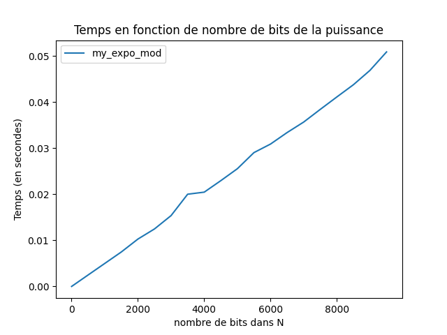
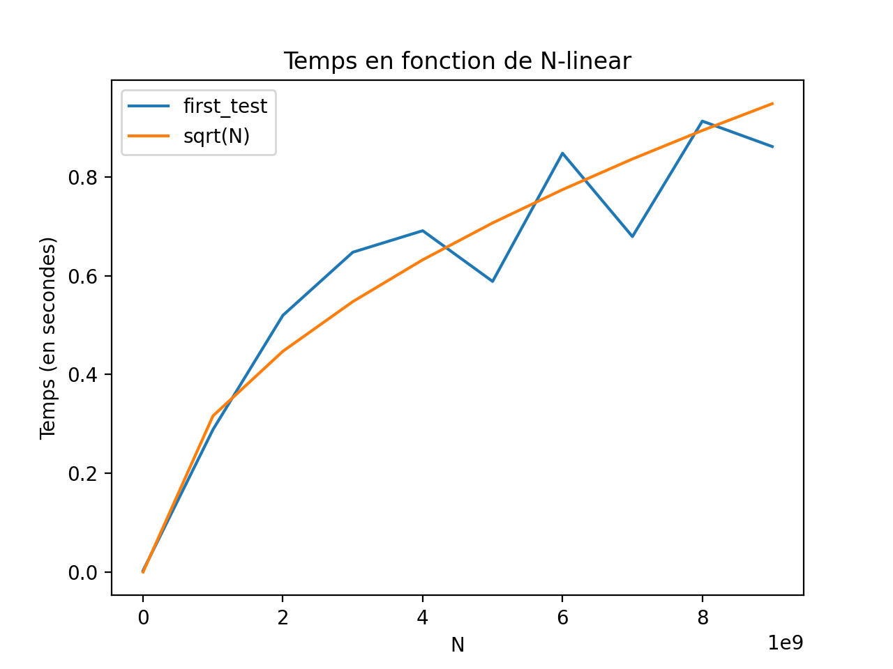

\
Complex: 4I900\

\

<span>**Rapport du projet : test primalité**</span>\
\

<span>0.4</span>

*Binôme*\
Mounib Benimam\
Guillaume Magniadas\

 

<span>0.4</span>

*chargé de Td*\
Florette Martinez

En 1801, C. F. Gauss écrivait dans *Disquisitiones Arithmeticae que
distinguer nombres premiers et nombres composés, et décomposer ces
derniers en facteurs premiers, est un des problèmes les plus importants
et les plus utiles en arithmétique*. Le but de ce projet est de
présenter certaines méthodes utilisées pour tester la primalité d’un
nombre entier.\

Le problème de primalité est le suivant :\
**Entrée** : un entier $N \in \mathbb{N}^{\star}$\
**Question** : N est-il premier ?\

Nous allons implanter un test de primalité naiif déterministe dont la
complexité est exponentielle. Ensuite, nous allons implanter deux tests
probabilistes de primalité efficaces mais qui se trompent de temps en
temps lorsque N est premier. Ainsi, si le test probabiliste retourne
premier alors l’entier est premier avec une certaine probabilité. En
revanche, si N est composé alors le test probabiliste retourne toujours
composé.

Arithmitique dans $\mathbb{Z}/n\mathbb{Z}$
==========================================

Dans cette partie nous allons poser les fonctions de base pour ce qui
suit

Calcule PGCD
------------

nous cherchons le dernier reste non nul

    def my_gcd(a, b):
        """
        int*int -> int
        """
        a, b = max(a, b), min(a, b)
        while b != 0:
            tempo = b
            b = a % b
            a = tempo
        return a

si nous voulons uniquement le PGCD, l’algorithme simplifié d’euclide est
plus rapide et suffisant. mais pour avoir les coefficients de Bezout
cela necessiet une implementation complète de l’algorithme d’euclide dit
etendu.

    def my_gcd_etendu(a, b):
        """
        int*int-> int*int*int
        """
        a, b = max(a, b), min(a, b)
        u = np.array([a, 1, 0])
        v = np.array([b, 0, 1])

        while(v[0] != 0):
            q = u[0]//v[0]
            temp = v
            v = u - q*v
            u = temp
        return tuple(map(int, u))

Une des opérations les plus importantes en l’arithmétique modulaire est
l’inverse $a^{-1} \in \mathbb{Z}/n\mathbb{Z}$ tel que
$aa^{-1} \equiv 1[n]$, un tel élèment existe ssi a, n sont premier entre
eux :

$$\forall n \forall a, \quad PGCD(a, n)=1 \iff \exists b \in \mathbb{Z}/n\mathbb{Z}, ab \equiv 1[n]$$

et particulierement si n est premier un inverse existe toujours et
$\mathbb{Z}/n\mathbb{Z}$ est alors un corps.

$$\forall n, \forall (a<n), \quad \mathit{estPremier}(n) \implies (\mathit{PGCD}(n, a)=1).$$

    def my_inverse(a, N):
        """int*int->int
        retourner inverse de a modulo N
        """
        # tester tout les nombres
        for b in range(N):
            if(((a*b) % N) == 1):
                return b
        # si on trouve pas d'inverse
        print(f"{a} n'a pas d'inverse modulo {N}")

    def my_inverse_bezout(a, N):
        """ inverse en utilisant euclide_etendu"""
        u0, u1, u2 = my_gcd_etendu(a, N)
        if(u0 == 1):
            return u2 if a<N else u1
        # si on trouve pas d'inverse
        print(f"{a} n'a pas d'inverse modulo {N}")

### Comparaison en temps

<span>0.5</span>

 [rot1]

<span>0.5</span>

 [rot2]

\

On peut observer sur ces courbes que la complexité de my\_gcd et de
my\_gcd\_etendu semble être polynomial au nombres de bits tendis que
my\_inverse exponentiel au nombre de bits.

my\_expo\_mod
-------------

Implementation de l’algorithme d’exponentiation binaire rapide,
complexité en

    def my_expo_mod(g, n, N):
        """
        int*int*int -> int
        return (g^n) % N
        """
        h = 1

        if n < 0:
            # puissance negative
            gcd, _, v = my_gcd_etendu(N, g)
            g = v
            n = -n
            
        l = n.bit_length()

        #Note: on met la range jusqu'a -1 pour que i prenne aussi la valeur 0.
        for i in range(l - 1, -1, -1):
            h = (h**2) % N

            if (n >> i) & 1 == 1:
                h = (h * g) % N

        return h

### Temps d’exécution expérimenté


[fig:exp~m~od]

Avec cette courbe, on peut en déduire que my\_exp\_mod croit de manière
lineaire au nombre de bits dans N. (donc logaritmiquement par rapport à
N)

Nombres pseudo-premier de Carmichael
====================================

Méthode déterministe test primalité
-----------------------------------

Ce teste sera une référence pour valider nos tests probabiliste

``` {.python language="Python" caption="Implementation" test="" primalité="" naïf=""}
def first_test(N):
    """
    int -> boolean
    """
    for i in range(2, int(np.sqrt(N))+1):
        if(N%i == 0): return False
    return True
```

### Complexité

Cet algorithme a une complexité en $\mathcal{O}(\sqrt{n})$ avec n le
nombre testé.

### Temps d’exécution expérimenté

 [fig:first~t~est]

On voit bien sur la figure que la complexité expérimenté semble tendre
vers la complexité $\mathcal{O}(\sqrt{n})$ où $n = 2^t$, la complexité
est donc exponentielle en nombre de bits du nombre n,
$\mathcal{O}(2^{t/2})$

### Nombre premier compté

Cette fonctions permet de compter 9592 nombres premier jusqu’a $10^5$.

isCarmichael
------------

Un nombre n est de carmichael, si n est un nombre composé,
$\forall b<n, \mathit{PGCD}(b, n)=1 \implies b^{n-1} \equiv 1 [n]$

``` {.python language="Python" caption="Implementation" test="" Carmichael=""}
def isCarmichael(n):
    n_divisors = 0
    for i in range(2, n):
        # (i premier avec n => i**(n-1) = 1[n])
        gcd = my_gcd(i, n)
        if (gcd == 1) and (my_expo_mod(i, n-1, n) != 1):
            return False

        if n%i == 0:
            n_divisors += 1

    if n_divisors == 0:
        # n est premier 
        return False
    
    return True
```

une implementation plus rapide est possible en utilisant le critère de
korselt, conaissant les facteurs premiers du nombre, si n n’est pas
divisible par un carré de premier, et quelque soit le facteur p de n,
$(p-1) \equiv 0[n-1]$

    def isCarmichael_facteurs(n, facteurs):
        """
        int*list->boolean
        tester si n est un nombre de carmichael, etant donné ses facteurs
        """
        for facteur in facteurs:
            # pas facteur premier carré
            if(n%(facteur**2) == 0):
                return False
            if((n-1)%(facteur-1) != 0):
                return False
        # pass le test
        return True

Note: une fonction gen\_carmichael est aussi disponible, qui utilise
cette fonction et boucle sur tout les entiers jusqu’à une limite et
liste tout les nombres de Carmichael jusqu’à cette dernière.

### le nombre de nombres premiers inferieur à $10^5$

En utilisant notre methode deterministe, on trouve : 9592 nombres
premiers, ce qui fait un ratio de $\frac{9592}{10^{5}}$, soit $9.59\% $

### Nombres de Carmichael listé

Voici la liste des nombres de Carmichael trouvé jusqu’à $10^5$ avec
cette fonction : 561, 1105, 1729, 2465, 2821, 6601, 8911, 10585, 15841,
29341, 41041, 46657, 52633, 62745, 63973 et 75361.

### Plus grand nombre trouvé

Avec cette méthode, le plus grand nombre de Carmichael trouvé en
approximativement 5 minutes est 1909001. (Note: une fonction
experience\_carmichael\_t a été créé pour cette expérience.)

Methodes probabiliste
=====================

gen\_carmichael3
----------------

    def gen_carmichael3(N=1e5, n_facteur_max=5):
        """
        int->int
        """
        premiers = [i for i in range(3, int(N), 2) if first_test(i)]
        nb_facteur = 3

        while True:
            acc = [premiers[np.random.randint(0, len(premiers)-1)]
                        for i in range(nb_facteur)]
            n = np.prod(acc, dtype=np.int64)

            if isCarmichael_facteurs(n, acc):
                return n

### Plus grand nombre trouvé

Avec cette méthode, le plus grand nombre de Carmichael trouvé en
approximativement 5 minutes est 3610008963601. (Ce résultat varie étant
donné le coté aléatoire de gen\_carmichael3) (Note: une fonction
experience\_carmichael3\_t a été créé pour cette expérience.)

Test\_fermat
------------

le test de fermat n’emmet pas de faux positifs, donc si test\_fermat
retourne false, on est sure à 100% qu’il s’agit d’un nombre composé,
mais on ne peux savoir si elle retourne vrai et n sera donc possible
premier avec une certaine probabilité.

Cette fonction prend n un entier impair,et retourne vrai si premier
possible ou faux si composé de manière certaine.

    def test_fermat(n, a=None):
        """
        n un entier impair
        Retourne vrai si premier possible
        faux si composé
        """
        if a == None:
            a = random.randrange(2, n)
        return my_expo_mod(a, n-1, n) == 1

### Taux d’erreurs

Note: Les pourcentage qui vont suivre sont fait sur $5 * 10^4$ valeurs
de taille maximale $10^5$ et les nombre tiré aléatoirement sont tous
impaire.\

<span>.5</span>  [fig:sub1]

<span>.5</span>  [fig:sub2]

\

 [fig:sub3]

[fig:test]

En tirant seulement des nombres de Carmichael, on obtient un taux
d’erreur d’environ 72.81%.\
En tirant seulement des nombres composé aléatoire, on obtient un taux
d’erreur d’environ 1.22%.\
En tirant des nombres aléatoires, on obtient un taux d’erreur d’environ
0.8%.\

nous pouvons voir clairement que fermat n’emmet jamais des faux
negatifs, et toutes nos erreur sont des faux positifs, de cette nature
on ne peut utiliser un teste de fermat dans des cas concret pour assurer
la primalité d’un nombre, par contre il pourrait servir dans une
co-routine pour éliminer rapidement des nombres qui ne sont pas premier,
et reduire l’espace de recherche pour utiliser d’autre testes plus
precis.

test\_miller\_rabin
-------------------

Dans cette partie nous allons coder un algorithme plus robuste que le
teste de fermat .\

    def test_miller_rabin(n, T=10):
        """
        int*int->boolean
        n = 1 + 2**h * m
        """

        p_h = 1
        temp = n-1
        while(temp%2 == 0):
            temp = temp // 2
            p_h *= 2
        m = (n-1)//p_h

        inf = n-3
        for i in range(T):
            a = 2 + random.getrandbits(n.bit_length())%(n-3)
            b = my_expo_mod(a, m, n)

            if b==1 or b==(n-1):
                continue

            for j in range(1, p_h):
                if b!=(n-1) and my_expo_mod(b, 2, n)==1:
                    return False
                elif  b==(n-1):
                    break
                b = my_expo_mod(b, 2, n)
            
            if b != (n-1):
                return False
        
        return True

Taux d’erreur
-------------

<span>.5</span> 
[fig:sub1]

<span>.5</span> 
[fig:sub2]

\

 [fig:sub3]

[fig:test]

En tirant seulement des nombres de Carmichael, on obtient un taux
d’erreur 0%.\
En tirant seulement des nombres composé aléatoire, on obtient un taux
d’erreur d’environ 0%.\
En tirant des nombres aléatoires, on obtient un taux d’erreur d’environ
0%.\

Pour avoir plus d’informations, nous testons l’effet du nombre
d’experiences sur la probabilité d’erreur de miller rabin


RSA
---

### gen\_rsa

    def gen_rsa(t):
        """
        int: longeur en bits (doit être supérieur a 2)
        return: (e, n), (d, n)
        """

        inf = 1<<(t-1)

        while True:
            p = inf + random.getrandbits(t-1)
            if test_miller_rabin(p):
                break
        while True:
            q = inf + random.getrandbits(t-1)
            if test_miller_rabin(q) and q != p:
                break

        return p, q, p*q

Temps d’execution
-----------------

gen\_rsa est exponentiel en nombres de bits


### BONUS:

Il aurait été dommage de conclure sans terminer le protocole RSA, nous
avons donc aussi implémenté une fonction RSA, générant une paire de clef
privée et public. Ces dernières sont utilisable dans les dernières
fonctions, encode et decode pour encoder et décoder des messages.

On commence d’abords par générer 2 nombres premiers grands $p, q$ , pour
construire un nombre $n = p.q$ $\phi(n)$ est le nombre de nombres
premier avec n (ce qui est dure a calculer directement), alors on
chercherait plutôt à utiliser l’inverse n -
nombre\_pas\_premier\_avec\_n, qui est beaucoup plus facile étant donné
qu’on connaît les seuls diviseur de n (p et q), et donc un nombre pas
premier avec n s’écrirait

$$\label{eq1}
\begin{split}
\mathit{nombre\_pas\_premier\_avec\_n} & = \# (\{i.p\ | i \in [1 \dots q]\}\cup \{i.q\ | i \in [1 \dots p]\})\\
 & = (q-1) + (p-1) + 1 \\
 & = (q-1) + p
\end{split}$$

$$\label{eq1}
\begin{split}
\phi(n) & = n - \mathit{nombre\_pas\_premier\_avec\_n} \\
 & = p.q - ((q-1) + p) \\
 & = p.q - (q-1) - p \\
 & = p(q-1) - (q-1) \\
 & = (q-1).(p-1)
\end{split}$$

l’etape suivant consiste à trouve un nombre inversible modulo $\phi(n)$
$e, d$ $$d.e \equiv 1[\phi(n)]$$

ces deux nombre $e, d$, constitueront ,avec n, respectivement la
clé\_publique, et la clé\_privé\

``` {.python language="Python" caption="RSA"}
def RSA(t):
    """
    return public_key, private_key
    """
    p, q, n = gen_rsa(t)

    # phi (nombre de nombres premier avec n, < n)
    phi = (p-1)*(q-1)

    while True:
        e = 2 + random.getrandbits(phi.bit_length())%(phi-3)
        gcd, _, d = my_gcd_etendu(phi, e)
        if(gcd == 1):
            break
    
    return (e, n), (d, n)
```

Pour encoder un message $m$ il suffit de faire $s = m^e[n]$ et
finallement pour décoder $m = s^d[n]$ cela marche en utilisant le petit
theorem de fermat ameliotré: $$a^{\phi(n)} \equiv 1 [n]$$
$$s^d = (m^e)^d = m^{e.d} = m^{1 + k.\phi(n)} = m^1.m^{\phi(n) = m[n]}$$

``` {.python language="Python" caption="Encodage" et="" décodage=""}
def encode(m, public_key):
    """
    (e, n)
    """
    return [my_expo_mod(ord(c), *public_key) for c in m]

def decode(m, private_key):
    """
    (d, n)
    """
    return ''.join([chr(my_expo_mod(c, *private_key)) for c in m])
```

Conclusions
===========

Pour conclure

A travers ces différents exercices, nous avons implémenté plusieurs
algorithmes probabilistes dans le but de répondre au problème de la
primalité. Au vu des résultat obtenue, nous nous somme rendu compte de
l’intérêt et de la puissance des algorithme probabiliste, qui dans ce
cas ci, permettent de répondre au problème de primalité avec des taux
d’erreur très acceptable et des vitesses supérieur aux algorithmes
déterministes classique. L’utilité de ce type d’algorithme est d’autant
plus concrète une fois appliqué sur des problèmes plus concrets tel que
le chiffrement RSA par exemple, nous obtenons une vitesse de chiffrement
très convenable, chose qui n’aurait pas été possible en utilisant le
test de primalité classique.
